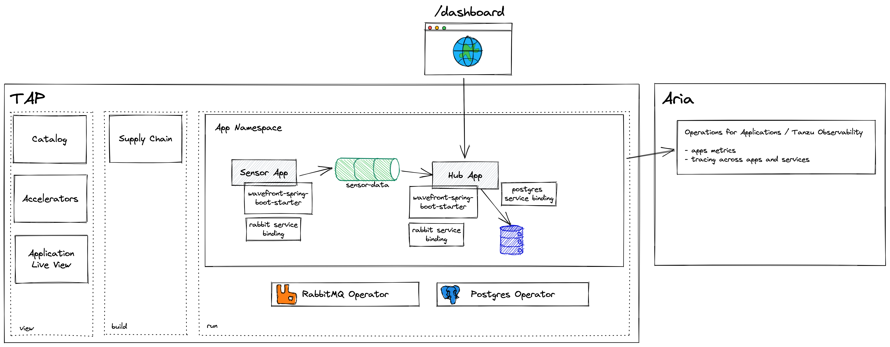

# TAP Sensors Demo App

An application to demonstrate the capabilities of [VMware Tanzu Application Platform](https://tanzu.vmware.com/application-platform).

This application consists of two services:
- Sensor service(s), which periodically publishes events with sensor data
- Hub service, which consumes sensors' events and stores data in its database; also comes with a web dashboard

Features:
- [Spring Cloud Stream](https://spring.io/projects/spring-cloud-stream), a framework built on top of Spring Boot
  and Spring Integration, is used as a flexible messaging abstraction. Spring Cloud Stream supports a variety of binder
  implementations. In this case, we are using the one for RabbitMQ.
- Service Bindings - binding an application workload to a backing service such as a RabbitMQ is one of the most
  important use cases within the context of the VMware Tanzu Application Platform. This use case is made possible
  by the [Service Binding Specification](https://github.com/servicebinding/spec) for Kubernetes. With the service
  binding that is defined in the workload.yml (found under config folder in the respective app), the credentials that
  are required for the connection to the RabbitMQ cluster or PostgreSQL are magically injected into the container
  and the Spring Boot application.
- VMware Aria Operations for Applications (a.k.a. Tanzu Observability, a.k.a. Wavefront) - monitoring a running
  application is one of the most important Day-2 operations concern. A Spring Boot provides seamless integrates with
  Wavefront and publishes application metrics and allows for tracing requests across a distributed system including
  services such as RabbitMQ and PostgreSQL.




## Prerequisites

- Access to an instance of VMware Tanzu Application Platform (`dev`, `light` or `full`)
- A namespace
- [Postgres Operator](https://docs.vmware.com/en/VMware-SQL-with-Postgres-for-Kubernetes/2.0/vmware-postgres-k8s/GUID-install-operator.html) package installed on TAP
- [Rabbit Cluster Operator](https://www.rabbitmq.com/kubernetes/operator/install-operator.html) package installed on TAP
- Privileges of:
  - platform operator, to create ClusterInstanceClass and ClusterRole k8s resources
  - app operator, to create RabbitmqCluster, Postgres and ResourceClaim k8s resources

### Service Operator - Make services available
To run this application with VMware Tanzu Application Platform, you need a RabbitMQ cluster running in the same
Kubernetes namespace (e.g. provisioned via the [RabbitMQ Cluster Operator for Kubernetes](https://www.rabbitmq.com/kubernetes/operator/operator-overview.html)).

You also need an instance of PostgreSQL database running in the same Kubernetes namespace
(e.g. provisioned via the [VMware Postgres Operator](https://docs.vmware.com/en/VMware-SQL-with-Postgres-for-Kubernetes/2.0/vmware-postgres-k8s/GUID-index.html)).

#### RabbitMQ Cluster

To make services available for an app operator to claim, the service operator needs to run the following commands:
```shell
kubectl apply -f config/service-operator/rabbit-claims-rbac.yml
kubectl apply -f config/service-operator/rabbit-cluster-instance-class.yml
kubectl apply -f config/service-operator/sensors-rabbit.yml
```

#### PostgreSQL

To make services available for an app operator to claim, the service operator needs to run the following commands:
```shell
kubectl apply -f config/service-operator/postgres-cluster-instance-class.yml
kubectl apply -f config/service-operator/postgres-claims-rbac.yml
kubectl apply -f config/service-operator/sensors-db.yml
```

### App Operator

#### RabbitMQ Cluster

To claim RabbitMQ service:
```shell
kubectl apply -f config/app-operator/sensors-rabbit-claim.yml
```

#### PostgreSQL

To claim Postgres database:
```shell
kubectl apply -f config/app-operator/sensors-db-claim.yml
```

## Deploying application/services

### Sensor service
To deploy the sensor service on VMware Tanzu Application Platform, execute the following command:
```shell
tanzu apps workload apply -f sensor/config/workload.yml
```

### Hub service
To deploy the hub service on VMware Tanzu Application Platform, execute the following command:
```shell
tanzu apps workload apply -f hub/config/workload.yml
```

You can access the application's UI using the URL shown by running the following command (provided you have DNS configured for Cloud Native Runtimes):

```shell
tanzu app workload get tap-sensors-hub
```

## Configuring application/services

### Wavefront
For both services, to be able to publish metrics to Wavefront, they need to be configured with the Wavefront URI
and API token. Each service comes with an application.yml configuration file under `src/main/resources`. They have been
preconfigured for the Wavefront SaaS freemium account, however the API token was omitted in the configuration.

If you want to publish metrics to other instance of Wavefront/Tanzu Observability, you can change application.yml
configs accordingly.

If you want to use the freemium one, please follow the steps below to generate and set the API token.

#### Generate Wavefront freemium token

1. Clean old token - optional
If you have ever configured Wavefront freemium token, it leaves behind some file with a token on your file system.
Please run the provided script for cleaning that up:
```shell
bin/clean-wavefront-token
```

2. Start the sensor service
Start one of the services on your local, lets say the sensor one
From the root folder of the project, run the following commands:
```shell
docker compose up -d
./gradlew ./gradlew sensor:bootRun
```
See more on running the application locally [below](#running-on-local)

3. Extract API token from logs
When the service starts successfully it will connect to the Wavefront SaaS and provision you a freemium account and
crate an API token. The details are logged in the console and include the Wavefront URI, API token and a unique link to
your dashboard within Wavefront. Please capture those details.

4. Add API token to app configuration
You can simply set the environment variable:
```shell
export MANAGEMENT_WAVEFRONT_API_TOKEN=<your-api-token>
```
Alternatively, you can add `api-token` under the `management.wavefront` section, at the same level as `uri`.

## Running on local

### Prerequisites

- Java Development Kit (JDK) 17 or newer
- Docker Desktop / Rancher Desktop for running RabbitMQ and PostgreSQL services

**Note**: all listed commands assume that you are running them from the root folder of the project

### Starting RabbitMQ and PostgreSQL services

**Pre-req**: Make sure your Docker/Rancher Desktop is running.

For your convenience, this project comes with [docker-compose.yml](docker-compose.yml) file that allows you to start
all the required services. To make it even easier, you can find scripts in the [bin](bin) folder:

To start both services, run
```shell
bin/services-up
```

To shut both services down, run:
```shell
bin/services-down
```

### Start both hub and sensor services
**Pre-req**: Make sure RabbitMQ and PostgreSQL services are running as docker containers (`docker compose ps`)

For your convenience, we provided a script that allows you to start both services:
```shell
bin/run
```

You can also run individual services with these commands
```shell
./gradlew hub:bootRun
./gradlew sensor:bootRun
```

### Valid the application is working

#### Sensor service
After the sensor service starts successfully it generates a sensor event every second. Each time a sensor event is
emitted it logs detail of that event. Check the console for logs.

Also, the service has healthcheck endpoint: [http://localhost:8081/actuator/health](http://localhost:8081/actuator/health)

#### Hub service
Every time the hub service receives a sensor event, it logs details of that event. Assuming your sensor service is
running and emitting events, your hub service should receive them and log them. Check the console for logs.

Also, the service has healthcheck endpoint: [http://localhost:8080/actuator/health](http://localhost:8080/actuator/health)

Finally, you can open [Hub's dashboard](http://localhost:8080/dashboard) in your browser, and you should see a table
containing realtime sensor data (refreshes every few seconds).
